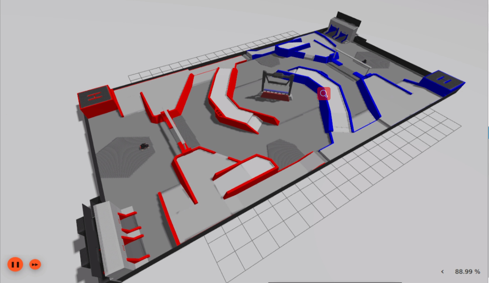
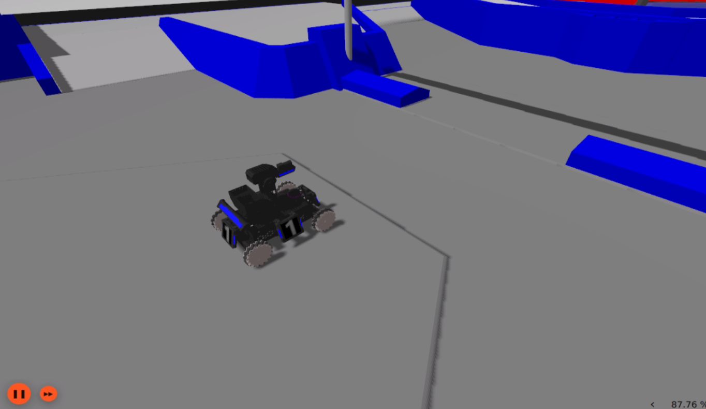
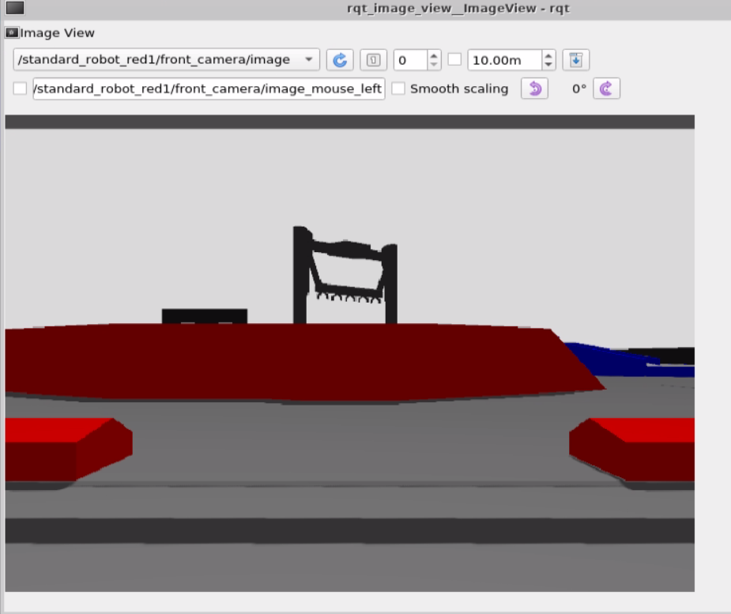

# rmuc2021_ignition_simulator


### 1.简介

rmuc2021_ignition_simulator是基于Ignition Gazebo的仿真环境，为RoboMaster University Championship 2021中的机器人算法开发提供仿真环境，加快开发效率，目前仅提供简易场地。

* RoboMaster University Championship 2021简易场地模型：
  * 模型来自于[robomaster BBS论坛官方发布](https://bbs.robomaster.com/forum.php?mod=viewthread&tid=11300) （2020.11.27版），若存在区别和误差，以官方为准。
  * 不包括基地，前哨站，能量机关等复杂设施，也不包含场地纹理。

> 注意：[Ignition Gazebo](https://github.com/ignitionrobotics/ign-gazebo)目前依然处于快速开发期，仿真功能不完善，且可能存在Bug。

### 2.使用说明

**环境配置**

ROS2和Ignition版本

* ROS2：foxy
* Ignition：Dome

```bash
# install ros-ign package
sudo apt-get install ros-foxy-ros-ign
# cd src directory of ros2 workspace 
git clone https://github.com/robomaster-oss/rmoss_interfaces
git clone https://github.com/robomaster-oss/rmoss_ign
git clone https://github.com/robomaster-oss/rmoss_ign_resources
git clone https://github.com/robomaster-oss/rmua19_ignition_simulator
git clone https://github.com/robomaster-oss/rmuc21_ignition_simulator
# cd ros2 workspace
colcon build
```

* 使用rmua19_ignition_simulator中的标准步兵机器人，所以依赖于rmua19_ignition_simulator.

**启动仿真环境**

```bash
ros2 launch rmuc21_ignition_simulator standard_robot1v1.launch.py 
```

* 注意：需要点击ignition界面上的橙红色的`启动`按钮



包含两个步兵机器人(red1和blue1)



**控制机器人移动** （以red1步兵机器人为例）

```bash
ros2 run rmua19_ignition_simulator test_control_chassis.py --ros-args -r __ns:=/standard_robot_red1 -p v:=0.3 -p w:=0.3
```

根据以下提示输入

```bash
This node takes keypresses from the keyboard and publishes them
as ChassisCmd messages.
---------------------------
Moving around:
        w    
   a    s    d
turn : '[' for left  ']' for right
stop : space key
---------------------------
CTRL-C to quit
```

**控制机器人云台** （以red1步兵机器人为例）

```bash
ros2 run rmua19_ignition_simulator test_control_gimbal.py --ros-args -r __ns:=/standard_robot_red1
```

根据以下提示输入

```bash
This node takes keypresses from the keyboard and publishes them
as GimbalCmd messages.
---------------------------
contorl around:
        w    
   a    s    d
change  interval : '[' to decrease,  ']' to increase
---------------------------
CTRL-C to quit
```

**云台相机图像查看**

```bash
ros2 run rqt_image_view rqt_image_view 
```

* 选择相应`topic`即可



### 3.维护者及开源许可证

maintainer: Zhenpeng Ge, zhenpeng.ge@qq.com

rmuc2021_ignition_simulator is provided under MIT.
